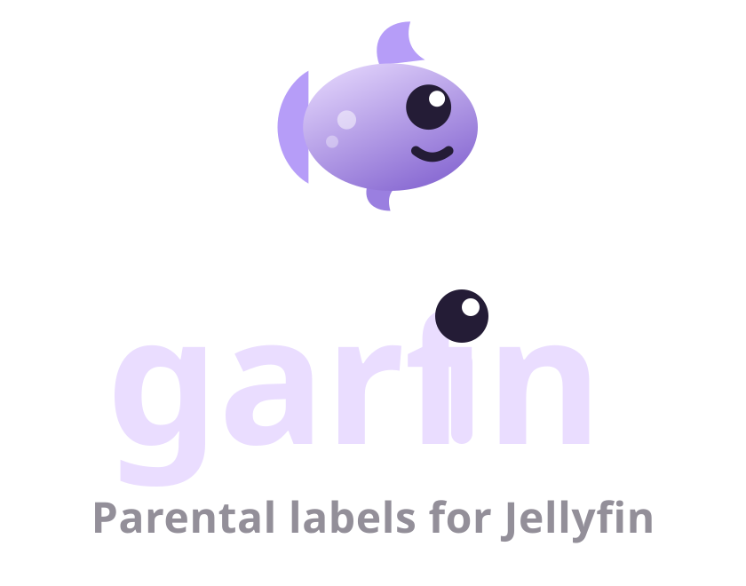

<!--
SPDX-FileCopyrightText: 2026 missing-foss

SPDX-License-Identifier: GPL-3.0-or-later
-->

  

  <b>Hand-pick what your kids can watch.</b> 
  An Android app for managing Jellyfin parental controls through tags.

  
  
  

---

Jellyfin can restrict what a user sees by tag, but tagging hundreds of items one at a time in the
web admin is miserable. Garfin puts the whole thing on your phone: pick a child, browse what they
can't see yet, and hand them a film, a series, or a whole collection in one tap.

## What it does

- Connects to your server with **Quick Connect** or a password (admin account required)
- Lists every user and shows which ones are actually under tag-based control
- Per child: which libraries they reach, and how many items they can see out of the total —
  counted by the server, not guessed
- Browse the library as posters, filtered by type, genre, decade, and the child's rating cap
- Assign a title to one or more children; the tag is written back to Jellyfin so it appears
  on their next refresh
- **Collections**: tag a set and every film inside gets it; tag one film from a set and Garfin
  asks whether to keep the set together
- Every write is previewed as a tag diff before it happens, and undoable after

## Status

Early. Nothing shipped yet — see `CLAUDE.md` for the build order.

## Documentation

| File | What's in it |
|---|---|
| [`CLAUDE.md`](CLAUDE.md) | Stack, conventions, ground rules |
| [`docs/DECISIONS.md`](docs/DECISIONS.md) | Every design decision and why |
| [`docs/UI-SPEC.md`](docs/UI-SPEC.md) | Screen-by-screen behaviour |
| [`docs/JELLYFIN-API.md`](docs/JELLYFIN-API.md) | Endpoints and the things that bite |
| [`docs/PR-REVIEW-BRIEF.md`](docs/PR-REVIEW-BRIEF.md) | Context to hand a PR reviewer |
| [`docs/GITHUB-API-BRIEF.md`](docs/GITHUB-API-BRIEF.md) | How to call GitHub without tripping rate limits |
| [`BRANDING.md`](BRANDING.md) | Logo, colours, type, licences |

`docs/ui-mockup.jsx` is a clickable React mockup of the whole app — a visual reference, not source.
Open `brand/garfin-design-pack.html` in a browser for the full identity system.

## Licence

Source is **GPL-3.0-or-later**. Brand artwork is **CC BY-SA 4.0** — see `BRANDING.md`.

Garfin is not affiliated with, endorsed by, or connected to the Jellyfin project.
Jellyfin is a trademark of Jellyfin, Inc.
